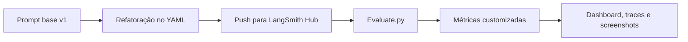

<div align="center">

# Desafio de Pull, Otimização e Avaliação de Prompts

Repositório com fluxo completo de pull, refatoração, push e avaliação de prompts no LangSmith Prompt Hub, com foco na conversão de bug reports em user stories claras, testáveis e acionáveis.


</div>

## Navegação Rápida

- [Prompt final](prompts/bug_to_user_story_v2.yml)
- [Dashboard no LangSmith](https://smith.langchain.com/o/371a2256-076b-45eb-ad9c-b471c6c03add/dashboards/projects/b202ddb7-66e7-4dfd-becb-ed0482054460)
- [Prompt publicado no Hub](https://smith.langchain.com/hub/glaucia86/bug_to_user_story_v2?organizationId=371a2256-076b-45eb-ad9c-b471c6c03add)
- [Checklist de entrega](evidence/checklist/final_delivery_evidence_2026-03-06.md)
- [Capturas de tela](docs/screenshots)

## Visão Geral

Este repositório entrega o fluxo pedido no exercício:

- pull do prompt base no LangSmith Hub;
- refatoração do prompt para melhorar a qualidade da user story;
- push da versão otimizada;
- avaliação automatizada com métricas customizadas;
- testes de validação do prompt;
- documentação final com links e evidências visuais.

## Fluxo do Projeto



## Resumo Executivo

| Item | Detalhe |
|---|---|
| Prompt final | `prompts/bug_to_user_story_v2.yml` |
| Dataset | `datasets/bug_to_user_story.jsonl` |
| Técnicas principais | Role Prompting, Few-shot Learning, Structured Output, Instruction Routing |
| Melhor checkpoint documentado | Gemini (`MAX_EVAL_EXAMPLES=1`) |
| Melhor resultado documentado | Média desafio `0.9375` e Clarity `0.9500` |
| Status do melhor checkpoint | Aprovado no gate obrigatório |
| Revalidações posteriores | Feitas com Gemma por restrição de quota free do Gemini |

## Entregável

- Repositório público com código-fonte implementado
- Prompt otimizado em `prompts/bug_to_user_story_v2.yml`
- Scripts de pull, push e avaliação
- Testes automatizados em `tests/test_prompts.py`
- Documentação final consolidada neste README

## Gate Oficial do Desafio

Nesta implementação, o gate de aprovação considera as 4 métricas obrigatórias abaixo:

| Métrica obrigatória | Mínimo |
|---|---:|
| Tone Score | 0.9 |
| Acceptance Criteria Score | 0.9 |
| User Story Format Score | 0.9 |
| Completeness Score | 0.9 |
| Média das 4 métricas | 0.9 |

As métricas F1-Score, Clarity e Precision permanecem como diagnóstico para iteração de prompt.

## Técnicas Aplicadas

| Técnica | Justificativa | Exemplo prático no projeto |
|---|---|---|
| Role Prompting | Define contexto de decisão de produto e qualidade técnica, reduzindo respostas superficiais. | O `system_prompt` define a persona de Senior Product Manager e Business Analyst para orientar tom, estrutura e foco. |
| Few-shot Learning | Ajuda o modelo a replicar padrões de saída com menor variação de formato. | O prompt v2 inclui mapeamentos explícitos para casos críticos e exemplos para bugs não críticos. |
| Structured Output | Melhora consistência de parsing e comparação contra referências de avaliação. | Regras fixam seções como `=== USER STORY PRINCIPAL ===`, `CRITERIOS DE ACEITACAO` e `CRITERIOS TECNICOS`. |
| Instruction Routing por Assinatura | Reduz ambiguidade em cenários complexos ao selecionar respostas canônicas para determinados tipos de bug report. | O prompt detecta assinaturas de casos críticos e retorna o bloco mapeado exatamente, sem paráfrase. |
| Iteração orientada a métricas | Permite refinamento incremental com base em scores e traces. | Cada iteração foi guiada por `src/evaluate.py`, comparando scores e ajustando regras e few-shots. |

## Resultados Documentados

### Melhor checkpoint documentado no LangSmith

Depois de ajustes adicionais no prompt, uma validação curta posterior com Gemini (`MAX_EVAL_EXAMPLES=1`) atingiu a melhor nota documentada durante a iteração.

| Grupo | Métrica | Score |
|---|---|---:|
| Configuração | Modelo principal | `gemini-3.1-flash-lite-preview` |
| Configuração | Modelo de avaliação | `gemini-3.1-flash-lite-preview` |
| Obrigatória | Tone Score | `0.9500` |
| Obrigatória | Acceptance Criteria Score | `0.9500` |
| Obrigatória | User Story Format Score | `0.9000` |
| Obrigatória | Completeness Score | `0.9500` |
| Diagnóstica | F1-Score | `1.0000` |
| Diagnóstica | Clarity | `0.9500` |
| Diagnóstica | Precision | `0.9700` |
| Derivada | Helpfulness | `0.9600` |
| Derivada | Correctness | `0.9850` |
| Resumo | Média desafio | `0.9375` |
| Resumo | Média diagnóstica | `0.9733` |
| Resumo | Status | `APROVADO (todas as 4 métricas obrigatórias >= 0.9)` |

### Checkpoint comparativo anterior com Gemini

A tabela abaixo mostra um checkpoint comparativo anterior usado durante a iteração, no mesmo fluxo de avaliação e com o mesmo dataset.

| Prompt | Helpfulness | Correctness | F1-Score | Clarity | Precision | Média Geral | Status |
|---|---:|---:|---:|---:|---:|---:|---|
| `leonanluppi/bug_to_user_story_v1` | 0.8233 | 0.8254 | 0.8208 | 0.8167 | 0.8300 | 0.8232 | Reprovado |
| `glaucia86/bug_to_user_story_v2` | 0.9333 | 1.0000 | 1.0000 | 0.8667 | 1.0000 | 0.9600 | Em otimização (Clarity < 0.9) |

### Nota de reprodutibilidade

A melhor rodada documentada durante a iteração foi obtida com modelos Gemini e está registrada nas capturas do LangSmith abaixo. Depois do esgotamento da cota free desses modelos, novas revalidações locais passaram a usar Gemma apenas para manter o pipeline funcional. Como a escolha do modelo interfere tanto na geração quanto na nota do avaliador, essas rodadas posteriores não são comparáveis 1:1 com a melhor validação Gemini documentada acima.

## Evidências Visuais

> Links públicos: [prompt-optimization-challenge](https://smith.langchain.com/o/371a2256-076b-45eb-ad9c-b471c6c03add/projects/p/b202ddb7-66e7-4dfd-becb-ed0482054460?timeModel=%7B%22duration%22%3A%221d%22%7D)
> Dashboard: [prompt-optimization-challenge](https://smith.langchain.com/o/371a2256-076b-45eb-ad9c-b471c6c03add/dashboards/projects/b202ddb7-66e7-4dfd-becb-ed0482054460)

### Dashboard e checkpoint principal

<p align="center">
  
</p>

### Baseline vs prompt otimizado

| Baseline v1 | Melhor checkpoint v2 |
|---|---|
|  |  |

| Score baixo | Score alto |
|---|---|
|  |  |

### Traces detalhados

| Trace 1 | Trace 2 | Trace 3 |
|---|---|---|
|  |  |  |

## Como Executar

### Pré-requisitos

- Python 3.9+
- Conta no LangSmith
- Chave de API do provider de LLM (OpenAI ou Google Gemini)

### 1) Configurar ambiente

```bash
python -m venv .venv

# Windows (PowerShell)
.venv\Scripts\Activate.ps1

# Windows (bash)
source .venv/Scripts/activate

pip install -r requirements.txt
```

### 2) Configurar variáveis de ambiente

Crie ou edite o arquivo `.env`.

Observação: os modelos abaixo são apenas um exemplo de configuração. Ajuste conforme a disponibilidade de quota no provider.

```env
LANGSMITH_API_KEY=...
LANGSMITH_ENDPOINT=https://api.smith.langchain.com
USERNAME_LANGSMITH_HUB=seu_usuario

LLM_PROVIDER=google
LLM_MODEL=gemini-2.5-flash
EVAL_MODEL=gemini-2.5-flash
GOOGLE_API_KEY=...

# opcional
LANGSMITH_PROJECT=prompt-optimization-challenge
MAX_EVAL_EXAMPLES=5
EVALUATE_BASELINE_PROMPT=false
```

### 3) Pull do prompt base (v1)

```bash
python src/pull_prompts.py
```

### 4) Refatoração do prompt (v2)

- Arquivo alvo: `prompts/bug_to_user_story_v2.yml`
- Aplicar técnicas de engenharia de prompt (few-shot, role, estrutura, regras explícitas)

### 5) Push do prompt otimizado

```bash
python src/push_prompts.py
```

### 6) Avaliação dos prompts

```bash
python src/evaluate.py
```

### 7) Executar testes de validação

```bash
pytest tests/test_prompts.py -v
```

### Exemplo no CLI

```bash
# Após refatorar o prompt
python src/push_prompts.py

# Executar avaliação do prompt otimizado (padrão atual)
python src/evaluate.py

Executando avaliação dos prompts...
================================
Modo de avaliação: apenas prompt otimizado (v2)
Prompt: glaucia86/bug_to_user_story_v2
- Helpfulness: 0.93
- Correctness: 1.00
- F1-Score: 1.00
- Clarity: 0.86
- Precision: 1.00
================================
Status: FALHOU - Clarity abaixo do mínimo de 0.9

# Opcional: incluir baseline v1 para comparação
EVALUATE_BASELINE_PROMPT=true python src/evaluate.py

# Checkpoint posterior após ajustes (Gemini, MAX_EVAL_EXAMPLES=1)
# Clarity: 0.95
# Média desafio: 0.9375
# Status: APROVADO
```

## Evidências no LangSmith

Checklist recomendado para anexar no envio:

- Link público do dashboard
- Link do prompt publicado no Hub
- Capturas do v1 e do v2 mostrando a evolução da iteração
- Traces detalhados de pelo menos 3 exemplos
- Nota curta informando o modelo usado na rodada principal documentada

Observação: o dataset local oficial do repositório base permanece em `datasets/bug_to_user_story.jsonl` e não foi alterado.

## Pacote Local de Apoio

Arquivos locais disponíveis neste repositório para apoiar a submissão:

- Capturas do LangSmith em `docs/screenshots/`
- Checklist consolidado em `evidence/checklist/final_delivery_evidence_2026-03-06.md`

Para envio final, o ideal é anexar as capturas existentes e usar o checklist local como resumo do material entregue.

## Estrutura do Projeto

```text
.
├── datasets/
│   └── bug_to_user_story.jsonl
├── evidence/
│   └── checklist/
│       └── final_delivery_evidence_2026-03-06.md
├── prompts/
│   ├── bug_to_user_story_v1.yml
│   └── bug_to_user_story_v2.yml
├── src/
│   ├── evaluate.py
│   ├── metrics.py
│   ├── pull_prompts.py
│   ├── push_prompts.py
│   └── utils.py
├── tests/
│   └── test_prompts.py
├── requirements.txt
└── README.md
```

## Sobre Mim

Sou A.I Developer trabalhando principalmente com **TypeScript/Node.js** e ecossistema **Azure**. Atualmente cursando MBA em Engenharia de Software com IA pela FullCycle.

Nos últimos anos concentrei minha produção técnica na interseção entre desenvolvimento de software e IA generativa: construí servidores MCP (Model Context Protocol), pipelines RAG com LangChain.js + Gemini, aplicações agenticas com GitHub Copilot SDK e cursos gratuitos de AI para a comunidade brasileira.

Alguns repositórios que refletem esse caminho:

| Projeto | Descrição | ★ |
|---|---|---:|
| [ai-js-course](https://github.com/glaucia86/ai-js-course) | Curso gratuito de AI com JavaScript/TypeScript | 114 |
| [microblog-ai-nextjs](https://github.com/glaucia86/microblog-ai-nextjs) | Microblog com geração inteligente de conteúdo via IA | 112 |
| [weather-mcp-server](https://github.com/glaucia86/weather-mcp-server) | MCP Server robusto em TypeScript para dados climáticos | 98 |
| [repocheckai](https://github.com/glaucia86/repocheckai) | CLI agêntica para análise de saúde de repositórios GitHub | 90 |
| [rag-search-ingestion-langchainjs-gemini](https://github.com/glaucia86/rag-search-ingestion-langchainjs-gemini) | Pipeline RAG com LangChain.js + Gemini + Docker | 75 |

Este projeto de engenharia de prompts faz parte desse conjunto de estudos práticos — onde o foco não é só fazer funcionar, mas entender e medir o que muda quando se ajusta um prompt com método.

GitHub: [@glaucia86](https://github.com/glaucia86) · LangSmith Hub: [`glaucia86`](https://smith.langchain.com/hub/glaucia86)
