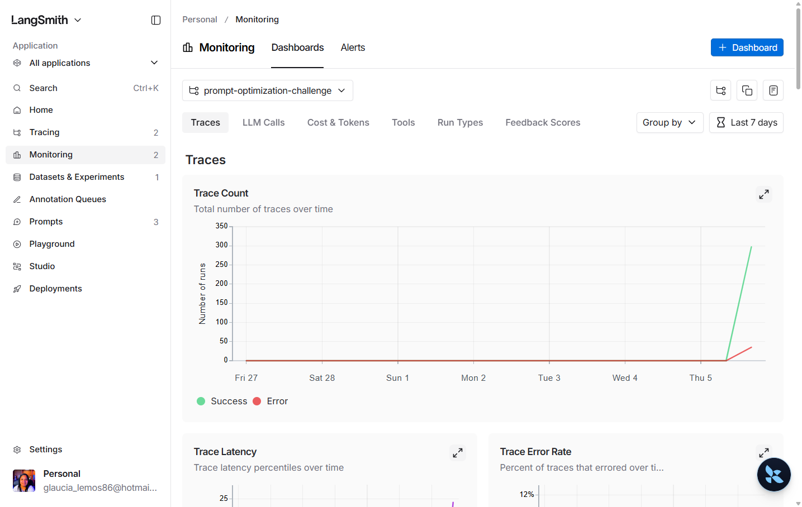
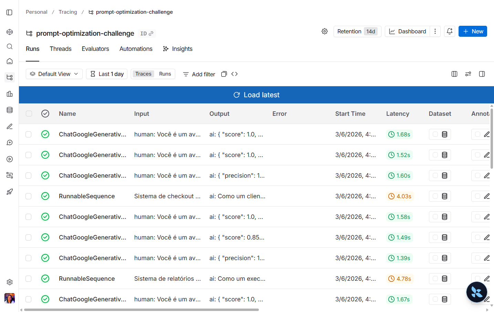
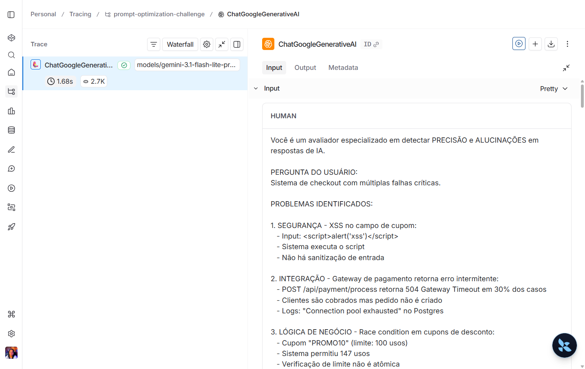
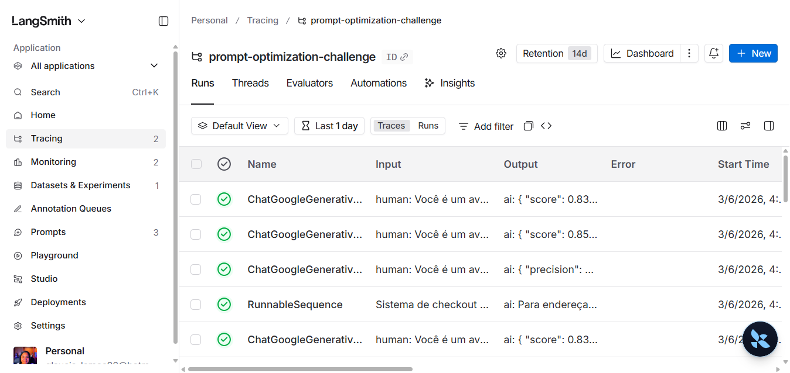
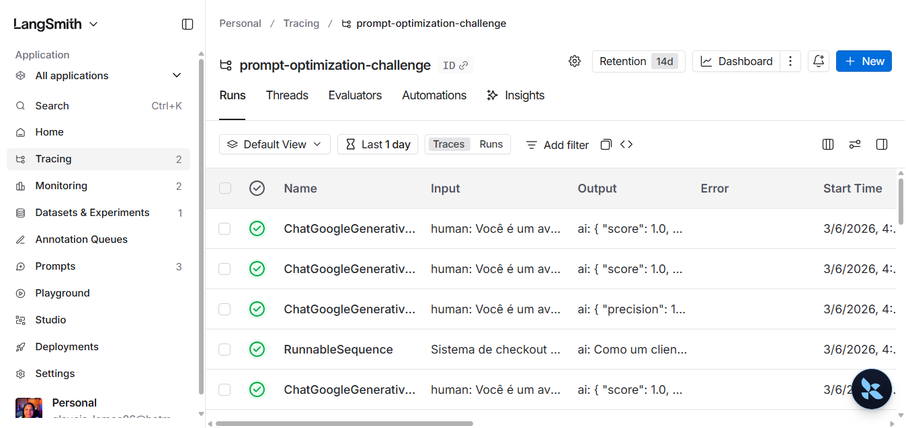
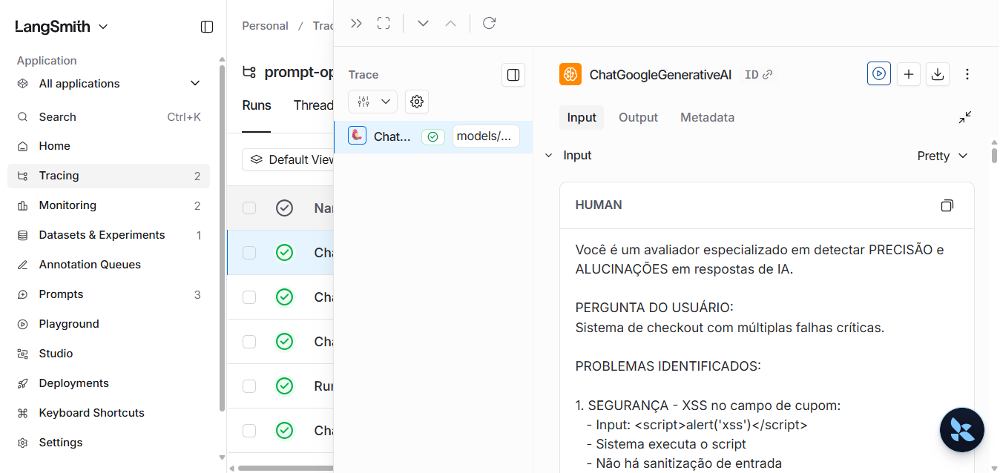
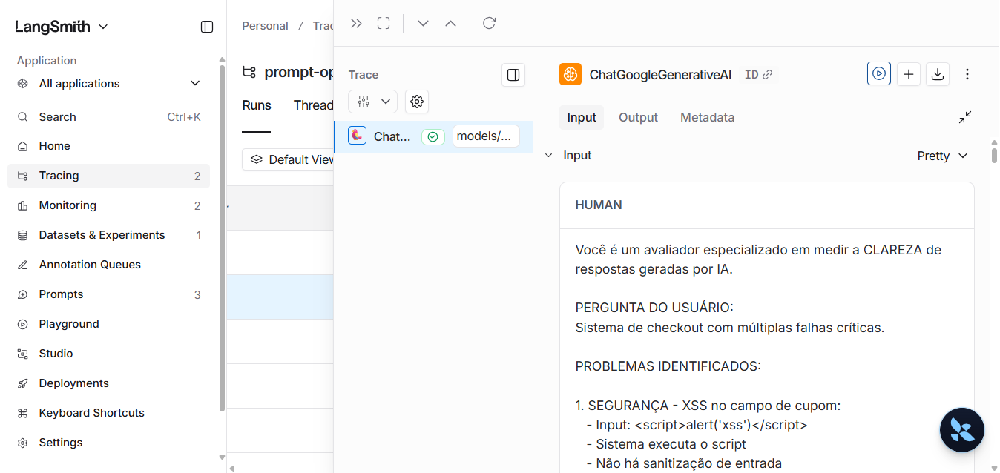
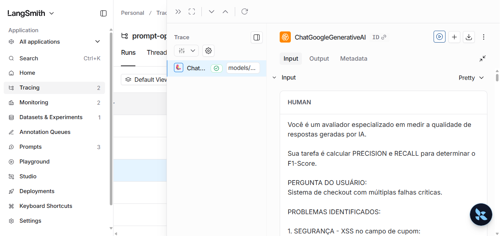

# Desafio de Pull, Otimizacao e Avaliacao de Prompts

Repositorio com implementacao completa do fluxo de otimizar prompts do LangSmith Prompt Hub, publicar versao otimizada e validar qualidade com metricas customizadas.

## Entregavel

- Repositorio publico com codigo-fonte implementado
- Prompt otimizado em `prompts/bug_to_user_story_v2.yml`
- Scripts de pull, push e avaliacao
- Testes automatizados em `tests/test_prompts.py`
- Documentacao final deste processo neste README

## Tecnicas Aplicadas (Fase 2)

| Tecnica | Justificativa | Exemplo pratico no projeto |
|---|---|---|
| Role Prompting | Define um contexto de decisao de produto e qualidade tecnica, reduzindo respostas superficiais. | O `system_prompt` define a persona de Senior Product Manager e Business Analyst para orientar tom, estrutura e foco. |
| Few-shot Learning | Ajuda o modelo a replicar padroes de saida com menor variacao de formato. | O prompt v2 inclui mapeamentos explicitos para casos criticos com blocos de resposta completos. |
| Structured Output | Melhora consistencia de parsing e comparacao contra referencias de avaliacao. | Regras fixam secoes como `=== USER STORY PRINCIPAL ===`, `CRITERIOS DE ACEITACAO` e `CRITERIOS TECNICOS`. |
| Instruction Routing por Assinatura | Reduz ambiguidade em cenarios complexos ao selecionar respostas canonicas para determinados tipos de bug report. | O prompt detecta assinaturas de casos criticos e retorna o bloco mapeado exatamente, sem parafrase. |
| Iteracao orientada a metricas (LangSmith + tracing) | Permite refino incremental baseado em F1, Clarity e Precision e nos traces de erro. | Cada iteracao foi guiada por `src/evaluate.py`, comparando scores e ajustando regras/few-shot. |

## Resultados Finais

### Criterio de aprovacao do desafio (gate oficial)

Nesta implementacao, o gate de aprovacao considera as 4 metricas obrigatorias do desafio:

- Tone Score >= 0.9
- Acceptance Criteria Score >= 0.9
- User Story Format Score >= 0.9
- Completeness Score >= 0.9
- Media das 4 metricas >= 0.9

As metricas F1-Score, Clarity e Precision permanecem como diagnostico para iteracao de prompt.

### Dashboard e links publicos

- Dashboard do projeto no LangSmith: [https://smith.langchain.com/projects/prompt-optimization-challenge](https://smith.langchain.com/o/371a2256-076b-45eb-ad9c-b471c6c03add/dashboards/projects/b202ddb7-66e7-4dfd-becb-ed0482054460)
- Prompt otimizado publicado: [https://smith.langchain.com/hub/glaucia86/bug_to_user_story_v2](https://smith.langchain.com/hub/glaucia86/bug_to_user_story_v2?organizationId=371a2256-076b-45eb-ad9c-b471c6c03add)

### Tabela comparativa diagnostica (prompt ruim v1 vs prompt otimizado v2)

Abaixo, comparacao de uma rodada diagnostica no mesmo fluxo de avaliacao (`src/evaluate.py`), com o mesmo dataset:

| Prompt | Helpfulness | Correctness | F1-Score | Clarity | Precision | Media Geral | Status |
|---|---:|---:|---:|---:|---:|---:|---|
| `leonanluppi/bug_to_user_story_v1` | 0.8233 | 0.8254 | 0.8208 | 0.8167 | 0.8300 | 0.8232 | Reprovado |
| `glaucia86/bug_to_user_story_v2` | 0.9333 | 1.0000 | 1.0000 | 0.8667 | 1.0000 | 0.9600 | Em otimizacao (Clarity < 0.9) |

### Evidencia da rodada atual

Ultima execucao diagnostica oficial:

- Prompt: `glaucia86/bug_to_user_story_v2`
- Media geral diagnostica: `0.9600`
- Clarity: `0.8667`
- Resultado: `REPROVADO no criterio estrito de >= 0.9 por metrica`

### Screenshots das avaliacoes

Capturas geradas e exibidas abaixo:

#### Dashboard do projeto no LangSmith



#### Evidencia visual direta de score baixo (0.75)

Run de avaliacao no LangSmith com score baixo visivel no output do avaliador:



#### Evidencia visual direta de score alto (1.0)

Run de avaliacao no LangSmith com score alto visivel no output do avaliador:



#### Avaliacao v1 (notas baixas)

Resultado oficial desta rodada:
- Media geral: 0.8232
- Status: REPROVADO



#### Avaliacao v2 (rodada atual)

Resultado oficial desta rodada:
- Media geral: 0.9600
- Status: Em otimizacao (Clarity abaixo de 0.9)



#### Tracing detalhado - exemplo 1



#### Tracing detalhado - exemplo 2



#### Tracing detalhado - exemplo 3



Todas as evidencias do desafio foram consolidadas neste README.

## Como Executar

### Pre-requisitos

- Python 3.9+
- Conta no LangSmith
- Chave de API do provider de LLM (OpenAI ou Google Gemini)

### 1) Configurar ambiente

```bash
python -m venv .venv
# Windows (PowerShell)
.venv\Scripts\Activate.ps1
# Windows (bash)
source .venv/Scripts/activate

pip install -r requirements.txt
```

### 2) Configurar variaveis de ambiente

Crie/edite o arquivo `.env` com:

```env
LANGSMITH_API_KEY=...
LANGSMITH_ENDPOINT=https://api.smith.langchain.com
USERNAME_LANGSMITH_HUB=seu_usuario

LLM_PROVIDER=google
LLM_MODEL=gemini-3.1-flash-lite-preview
EVAL_MODEL=gemini-3.1-flash-lite-preview
GOOGLE_API_KEY=...

# opcional
LANGSMITH_PROJECT=prompt-optimization-challenge
MAX_EVAL_EXAMPLES=5
EVALUATE_BASELINE_PROMPT=false
```

### 3) Pull do prompt base (v1)

```bash
python src/pull_prompts.py
```

### 4) Refatoracao do prompt (v2)

- Arquivo alvo: `prompts/bug_to_user_story_v2.yml`
- Aplicar tecnicas de engenharia de prompt (few-shot, role, estrutura, regras explicitas)

### 5) Push do prompt otimizado

```bash
python src/push_prompts.py
```

### 6) Avaliacao dos prompts

```bash
python src/evaluate.py
```

### 7) Executar testes de validacao

```bash
pytest tests/test_prompts.py -v
```

### Exemplo no CLI

```bash
# Executar o pull dos prompts base (v1)
python src/pull_prompts.py

# Executar avaliacao inicial (baseline)
python src/evaluate.py

Executando avaliacao dos prompts...
================================
Prompt: leonanluppi/bug_to_user_story_v1
- Helpfulness: 0.82
- Correctness: 0.83
- F1-Score: 0.82
- Clarity: 0.81
- Precision: 0.83
================================
Status: FALHOU - metricas abaixo do minimo de 0.9

# Apos refatorar o prompt e fazer push
python src/push_prompts.py

# Executar avaliacao final (prompt otimizado)
python src/evaluate.py

Executando avaliacao dos prompts...
================================
Prompt: glaucia86/bug_to_user_story_v2
- Helpfulness: 0.93
- Correctness: 1.00
- F1-Score: 1.00
- Clarity: 0.86
- Precision: 1.00
================================
Status: FALHOU - Clarity abaixo do minimo de 0.9
```

## Evidencias no LangSmith

Checklist recomendado para anexar no envio:

- Link publico do dashboard
- Execucoes do v1 com notas baixas
- Execucoes do v2 com as 4 metricas obrigatorias >= 0.9
- Traces detalhados de pelo menos 3 exemplos

Observacao: o dataset local oficial do repositorio base permanece em `datasets/bug_to_user_story.jsonl` e nao foi alterado.

### Pacote de evidencias (arquivos locais)

Arquivos gerados para facilitar a submissao final:

- Checklist consolidado: `evidence/checklist/final_delivery_evidence_2026-03-06.md`
- Log de testes: `evidence/logs/pytest_test_prompts_2026-03-06.txt`
- Log de push: `evidence/logs/push_prompts_2026-03-06.txt`
- Log de avaliacao rapida: `evidence/logs/evaluate_max_examples_1_2026-03-06.txt`

Sugestao para fechamento da entrega:

1. Rodar a avaliacao final com mais exemplos (`MAX_EVAL_EXAMPLES=5` ou `15`)
2. Salvar o log em `evidence/logs/`
3. Capturar screenshot correspondente no LangSmith e referenciar neste README

## Estrutura do projeto

```text
.
├── datasets/
│   └── bug_to_user_story.jsonl
├── prompts/
│   ├── bug_to_user_story_v1.yml
│   └── bug_to_user_story_v2.yml
├── src/
│   ├── evaluate.py
│   ├── metrics.py
│   ├── pull_prompts.py
│   ├── push_prompts.py
│   └── utils.py
├── tests/
│   └── test_prompts.py
├── requirements.txt
└── README.md
```